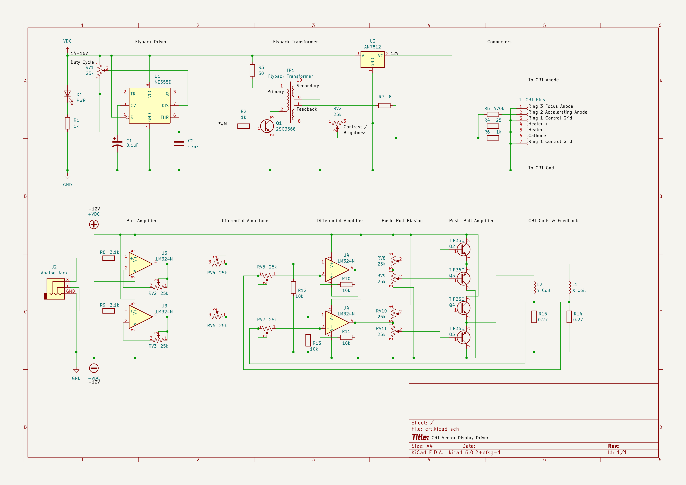

# CRT Vector Display Driver

## Overview
This project outlines the design of a driver circuit for a CRT screen. The tube used in this project is a 4" magnetic coil driven screen from a GE portable TV. No information could be found online about this tube, so the pinout of it and its corresponding flyback had to be reverse engineered. 

## Tube Power Supply
To power the CRT, several kilovolts must be provided to accelerate the electron beam. This is typically provided by a flyback transformer. As mentioned previously, the tube used in this project came with a transformer.
To drive the flyback transformer, a sinusoidal AC signal is approximated using a square wave generated with a monostable multivibrator.
This approach is not efficient, but it is sufficient for the size of the tube and is relatively simple.

## Circuit Schematic

*Datasheets are provided in the datasheets directory.

## Coil Driver
The coils of the CRT are responsible for the rendering.
Two signals are input to the driver, being the X and Y position of the beam, which range from -5V to 5V.
Each signal first runs through a pre-amplifier, which accomodates for the variety of signal generators used in testing.
The signals then go through negative feedback, unity gain, differential amplifiers, which receives feedback from the actual position of the beam.
Finally a set of push-pull amplifiers drives the high current required by the coils of the tube.
The position of the beam is proportional to the current drawn by each coil, but not the voltage of the coil. To accomodate for the effects of parasitic capacitance, this current is measured via a shunt resistor.
The voltage of this, proportional to the current, is used as the negative feedback for the differential amplifiers of the system.
- This design is derivative of one detailed in "The Secret Life of XY Monitors" by Jed Margolin. For a more in-depth explanation of its operation visit his work linked in the references.

## Generating X-Y Signals
Any device capable of generating two analog signals can be used with this driver, as long as the pre-amplifiers are capable of bringing it within range. The most accessible device which can do this is the audio output of a computer. The right and left channels can be mapped to X-Y (or vice versa) and images can be drawn. A tool known as "Rabiscoscopio" has been designed for this exact purpose (see Alex Porto's link below). Using Rabiscoscopio svg files can be converted to audio files and played. Several demos are also available for quick testing.

It is the goal of this project to use a microcontroller to generate these signals, although this is still a work in progress. In this repository are multiple files for the Arduino IDE which generate basic X-Y output. While the Arduino ATMEGA cannot generate pure analog signals, it can generate PWM signals which may be filtered using an RC filter. While this has its disadvantages, it is an accessible alternative to using a higher end microcontroller which generates these signals directly.

## References
- Cathode-Ray Tubes - Chuck DeVere (https://openlibrary.org/books/OL17878693M/Cathode-ray_tubes)
- Flyback Transformer Design Considerations for Efficiency and EMI - Texas Instruments (https://www.ti.com/seclit/ml/slup338/slup338.pdf)
- Operation of a Cathode Ray Tube - Georgia Institute of Technology
- Cathode Ray Tube Displays - MIT Radiation Laboratory (https://www.bunkerofdoom.com/lit/mitser/PREF22.PDF)
- Some Vector Generating Techniques for Cathode Ray Tube Display Systems - NASA Godoard Space Flight Center (https://ntrs.nasa.gov/api/citations/19670021973/downloads/19670021973.pdf)
- CRT Electron Beam Deflection with Microcontroller - Bob's Projects (https://bobparadiso.com/2015/04/13/crt-electron-beam-deflection-w-microcontroller/)
- The Secret Life of XY Monitors - Jed Margolin (http://www.jmargolin.com/xy/xymon.htm)
- Atari 19 and 25 Inch Color X-Y Display - Atari (https://www.andysarcade.net/personal/manualsother.htm)
- Wells-Gardner Quadrascan Color X-Y Display Service Manual - Atari - (https://archive.org/details/ArcadeGameManualTm183-2)
- Response of Electromagnetic Deflection for CRT Display - Hiroya Sano & Yoshihiro Tanada (https://core.ac.uk/download/pdf/12528813.pdf)
- Rabiscoscopio 2 - Alex Porto (https://dalpix.com/oscilloscope-drawing-everyone)
- Flyback Driver #1: Single Transistor Driver - Jozef Bogin Jr (http://boginjr.com/electronics/hv/flyback-driver-1/)
- Flyback Driver #2: NE555 Quasi-Resonant (http://boginjr.com/electronics/hv/flyback-driver-2/)
- Things to do: Drive a CRT - Jochen Kronjaeger (http://www.kronjaeger.com/hv-old/hv/do/crt/index.html)
